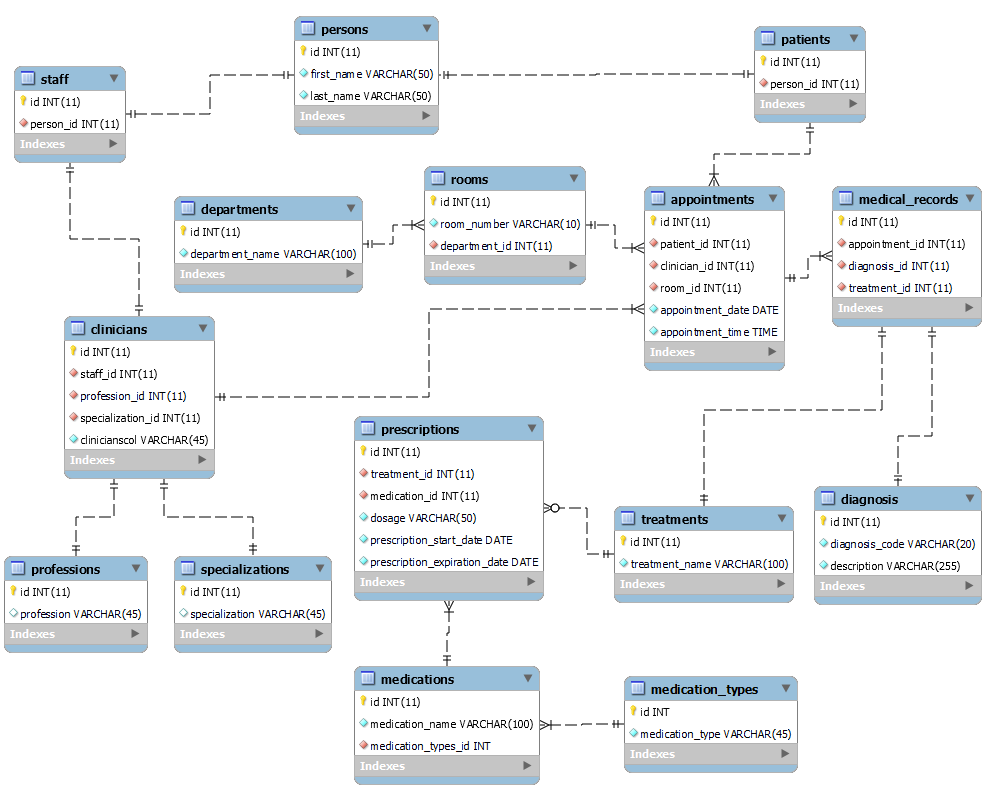

# HospitalApp

## About This Project:

This repository describes a Java Database Connectivity (JDBC) project portraying a simple hospital.
The project follows a JDBC architecture that includes a JDBC Data Access Layer (DAL) with associated
Data Access Objects (DAOs).

#### Continuous Integration (CI)

This project deploys automatic testing by using the `Surefire Plugin` for Maven to run unit tests and
GitHub Actions to automatically build and test the Java Maven package. Every time code changes are
pushed to the repository or a pull request is made, GitHub Actions is triggered to run tests and
ensure that the code is working as expected. Successful builds and tests are indicated with a green
checkmark :white_check_mark: next to the commit ID while failed builds or tests are indicated with a
red X :x:.

The maven.yml file in the `.github/workflows` directory of this repository contains the configuration
for GitHub Actions to run the tests.

The tests are composed of class unit tests using TestNG and are located in src/test/java/. By
employing automatic testing, we can catch issues early in the development process and ensure that
our code is always working as expected. This helps to maintain the quality of the code and make sure
that the project is stable and reliable.

## Iter-1

### Task

Requirements

- Build hierarchy for Schema from the below course.
    - The project follows a JDBC architecture that includes a JDBC Data Access Layer (DAL) with
      associated Data Access Objects (DAOs) representing the following schema diagram below.
    - 
- Create DAO classes with necessary interfaces, abstract classes, and Generics. DAO should be
  scalable and flexible to support another framework and another database as well. All CRUD
  operations should be supported using JDBC. Use connection pool from the below block.
    - All DAOs extend from generalized and abstracted `EntityDAO` that implements the `IEntityDAO`
      interface. This interface enforces CRUD operations and is supported by all DAOs that extend
      from the `EntityDAO` object.
    - `utils/ConnectionPool` implements a connection pool that manages connections obtained from the
      JDBC Data Access Layer.
    - Each connection in the DAL is implemented as a transaction that will rollback if an exception
      is encountered, otherwise the transaction is committed and the connection is closed.
- Implement Service layer with necessary abstraction to be able to switch between databases and
  frameworks.
    - A Service Layer is implemented that indirectly access each DAO in the DAL through
      the `DAOFactory` using the `getJDBCDAO` method to allow for access to JDBC DAO
      implementations. Abstraction and the ability to switch between databases and frameworks can be
      further realized by implementing different get methods specified by the desired database or
      framework.